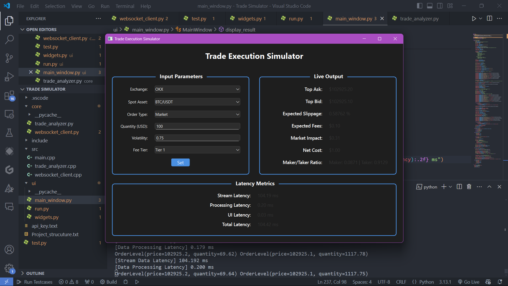

# GoQuant - Real-Time Trade Simulator

A real-time trade cost simulator built with Python, WebSocket streaming, and a PyQt6 user interface. This project estimates trade execution costs using live L2 order book data from the **OKX Exchange**, providing insights into slippage, market impact, fees, and execution probabilities for both maker and taker strategies.

---

## 🚀 Features

- 📡 **Real-Time WebSocket Integration** with OKX
- 📈 **Trade Cost Analysis** including:
  - Slippage
  - Exchange Fees (Tiered)
  - Market Impact (Quadratic Model)
  - Maker vs. Taker Execution Probability
- ⚡ **Latency Benchmarking**:
  - Stream data latency
  - Data processing latency
  - UI rendering latency
- 🖥️ **Interactive PyQt6 UI**
- 📊 **Volatility Estimation** using log returns

---

## 🧩 Tech Stack

| Layer            | Technology                    |
|------------------|-------------------------------|
| UI               | PyQt6                          |
| Data Ingestion   | `websockets` + `asyncio`       |
| Core Logic       | Python 3.10+                   |
| Market Analysis  | Custom regression and scoring  |
| Performance      | `time.perf_counter()` for latency logging |
| Data Structures  | `deque`, `dataclass`, `Enum`   |

---

## 📁 Project Structure

```bash
Trade Simulator/
├── core/                    
│   ├── __init__.py
│   ├── trade_analyzer.py
│   ├── websocket_client.py   
├── ui/                       
│   ├── __init__.py
│   ├── main_window.py        
│   └── widgets.py   
├── requirements.txt          
├── run.py                   
├── README.md
└── setup.py or pyproject.toml


+---------------------------------------------------------------+
|                      Trade Execution Simulator                |
|---------------------------------------------------------------|
| [Left Panel: Input]                | [Right Panel: Output]    |
|-----------------------------------|--------------------------|
| Exchange:       [OKX        ▼]    | Expected Slippage:   []  |
| Spot Asset:     [BTC/USDT ▼]      | Expected Fees:       []  |
| Order Type:     [Market     ]     | Market Impact:       []  |
| Quantity (USD): [   100     ]     | Net Cost:            []  |
| Volatility:     [   0.75    ]     | Maker/Taker Ratio:   []  |
| Fee Tier:       [ Tier 1 ▼ ]      | Internal Latency:    []  |
|                                   |                          |
|              [     Submit    ]    |                          |
+---------------------------------------------------------------+
```

---

## 🖼️ UI Preview



---

## ⚙️ How It Works

1. **Connects** to OKX WebSocket feed for order book data.
2. **Parses** bids and asks into `OrderBook` objects.
3. **Analyzes**:
   - Slippage (via a linear regression model)
   - Fee (based on selected fee tier)
   - Market Impact (quadratic model)
   - Maker/Taker Probability (logistic model)
4. **Displays** result in GUI with real-time latency stats.

---

## ⏱️ Performance Benchmark

| Metric                    | Value (Avg)   |
|---------------------------|---------------|
| Stream Data Latency       | 99.023 ms     |
| Data Processing Latency   | 0.322 ms      |
| UI Update Latency         | 0.280 ms      |
| **Total Loop Latency**    | ~99.625 ms    |

---

## 🧠 Optimization Techniques

- ✅ `deque(maxlen=50)` for bounded memory usage
- ✅ Non-blocking WebSocket with `asyncio`
- ✅ Thread-safe PyQt6 UI updates via signals
- ✅ Lightweight analytical models (linear & sigmoid)
- ✅ `@dataclass` and `Enum` usage for code clarity & structure

---

## 🛠️ Installation

```bash
git clone https://github.com/yourusername/trade-simulator.git
cd trade-simulator
pip install -r requirements.txt
python -m ui.run
```

> ✅ Python 3.10+ recommended

---

## 🎛️ Parameters

These can be adjusted in the UI:

- 💵 USD Amount
- 🎯 Fee Tier (TIER1 / TIER2 / TIER3)
- 📉 Volatility (user-defined or computed)

---

## 📌 Future Enhancements

- [ ] Historical backtesting mode
- [ ] Matplotlib/Plotly for real-time charts
- [ ] Add exchange selector (Binance, Coinbase)
- [ ] CSV logging & performance dashboard

---

## 📄 License

This project is licensed under the MIT License.

---

## 🙋‍♂️ Author

**Ayushman Pal**  
_Trading Systems & Python Enthusiast_  
[LinkedIn] | [GitHub] | [Email]
